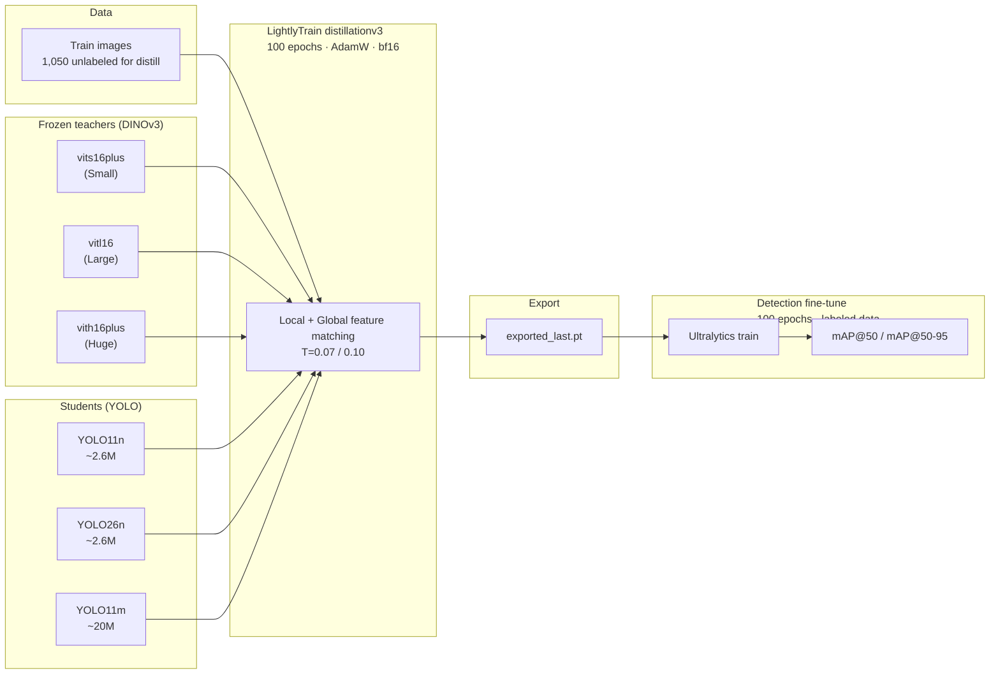
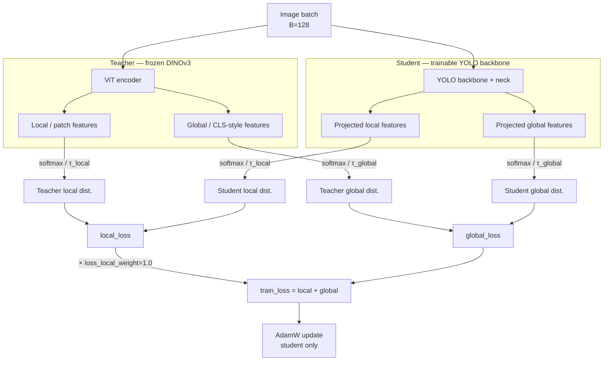

# Detection Models

Both CNN and transformer-based CV models were applied to achieve high-precision detection of floating debris on the sea surface.

---

## Baseline / Previous Work

A fine-tuned **YOLO11n** model (`best3.pt`) trained on a custom dataset (`Litter`) serves as the baseline for all later fine-tuning, distillation, and training.

### Custom Dataset — `Litter`

| Item | Value |
| :--- | :--- |
| **Config** | `Litter.yaml` |
| **Resolution** | `1920 × 1080` |
| **Format** | JPEG |

#### Split Overview

| Split | Images | Labels | Boxes |
| :---: | -----: | -----: | ----: |
| train | 1,050 | 1,050 | 5,736 |
| val   |   300 |   300 | 1,661 |
| test  |   152 |   151 |   784 |

---

### Baseline Model — `best3.pt`

#### Basic Info

| Attribute | Value |
| :--- | :--- |
| Model Name | `best3.pt` |
| Base Model | **yolo11n** |
| Task | Object Detection |
| Detection Class | `0: litter` |
| Parameters | 2,590,035 |
| GFLOPS | 6.4 |
| DTYPE | float16 |
| Size | 5.2 MB |

#### Fine-tuning Config

| Attribute | Value |
| :--- | :--- |
| Dataset | Litter |
| Data Config | `data2.yaml` |
| Epochs | 2 |
| Image Size | 640 |
| Batch Size | 8 |
| Optimizer | None |
| LR schedule | `lr0=0.01`, `lrf=0.01` |
| AMP Enabled | `False` |

#### Model Performance

| Metric | Value |
| :--- | ---: |
| Precision | 0.948 |
| Recall | 0.883 |
| mAP@50 | 0.950 |
| mAP@50-95 | 0.682 |
| Val box / cls / dfl loss | 7.5 / 0.5 / 1.5 |

<table>
  <tr>
    <td align="center" width="50%">
       
      <em>Confusion Matrix</em>
    </td>
    <td align="center" width="50%">
       
      <em>Training Results</em>
    </td>
  </tr>
</table>

---

## Fine-tuning

The baseline (`best3.pt`) was originally fine-tuned for only **2 epochs** — far below a typical YOLO schedule. To check whether the epoch limit was holding performance back, a new YOLO11n fine-tuning run was conducted.

### Fine-tuning Platform
- Dell Precison 5490
    - CPU: Intel Ultra7 165H
    - GPU: NVIDIA RTX 2000 Ada Mobile

### Fine-tuning Configuration

| Attribute | Value |
| :--- | :--- |
| Base Model | `yolo11n.yaml` |
| Dataset | `Litter` |
| Detection Class | `0: litter` |
| Image Size | 640 |
| Batch Size | 16 |
| Optimizer | AdamW |
| Epochs | 100 |
| LR schedule | `lr0=0.01`, `lrf=0.01` |
| AMP Enabled | `True` |

### Model Performance

| Metric | Value |
| :--- | ---: |
| Precision | 0.9752 |
| Recall | 0.9555 |
| mAP@50 | 0.9787 |
| mAP@50-95 | 0.7807 |
| Val box / cls / dfl loss | 0.747 / 0.375 / 0.833 |

<table>
  <tr>
    <td align="center" width="50%">
       
      <em>Confusion Matrix</em>
    </td>
    <td align="center" width="50%">
       
      <em>Training Results</em>
    </td>
  </tr>
</table>

### Performance Comparison

| Metric | 2 epochs | 100 epochs |
| :--- | ---: | ---: |
| Precision | 0.948 | 0.9752 (+2.9%) |
| Recall | 0.883 | 0.9555 (+8.2%) |
| mAP@50 | 0.950 | 0.9787 (+3.0%) |
| mAP@50-95 | 0.682 | 0.7807 (+14.5%) |
| Val box / cls / dfl loss | 7.5 / 0.5 / 1.5 | 0.747 / 0.375 / 0.833 |

>With `epochs` set to 2, fine-tuning was clearly under-powered. Given that only a CPU was used for the original run, it is likely the trainer chose a small epoch count to cut wall-clock time — at the cost of model performance.

---

## Distillation

This part introduces a <u>**feature distillation from frozen pretained foundation models**</u>. 

To actualize the best distillation performance, multiple teacher-student combinations were tested as follow

| Combination | Teacher Model | Student Model |
| ----------- | ------------- | ------------- |
| 1 | vits16plus | yolo11n |
| 2 | vitl16 | yolo11n |
| 3 | vith16plus | yolo11n |
| 4 | vits16plus | yolo26n |
| 5 | vitl16 | yolo26n |
| 6 | vith16plus | yolo26n |
| 7 | vits16plus | yolo11m |
| 8 | vitl16 | yolo11m |
| 9 | vith16plus | yolo11m |
| 10 | vitl16plus | yolo26m |

- Distillation Overview

| Item | Value |
| :--- | ----: |
| Foundation Model | *See Above* |
| Student Model | *See Above* |
| Training Framework | `LightlyTrain` |
| Training Method | `distillationv3` |
| Sample Training Script | [distill.py](/Detection/Distillation/distill.py) |
| Epochs | 100 |
| Steps | 800 |
| Batch Size | 128 |
| Optimizer | AdamW |
| DTYPE | BF16-mixed |
| Dataset | `Litter` |

- Training Pipeline

- Training Step

