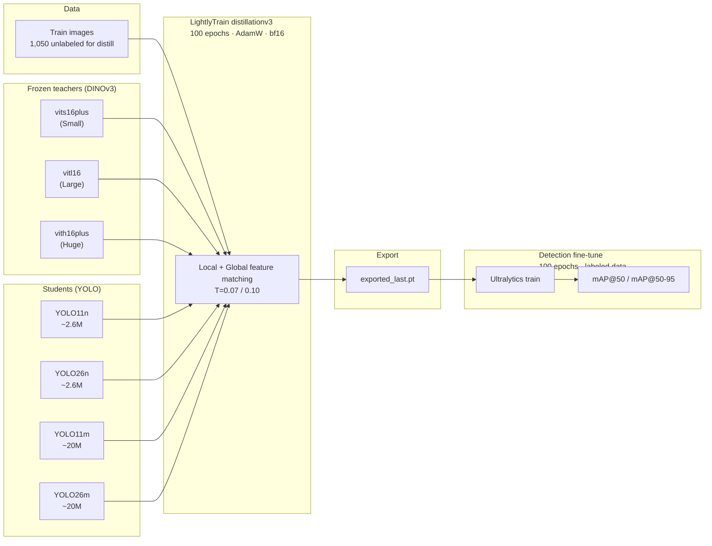
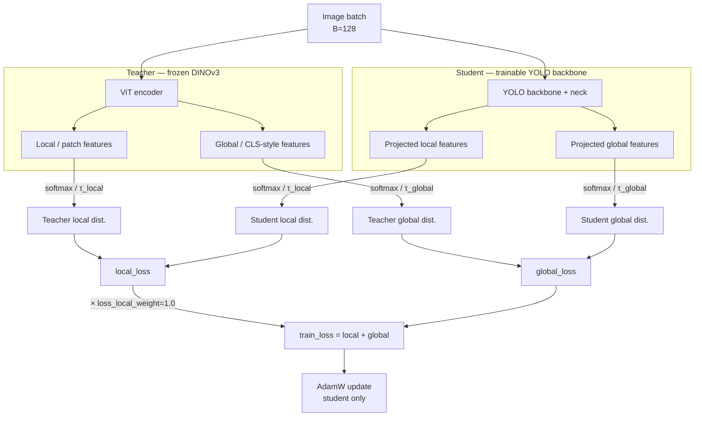
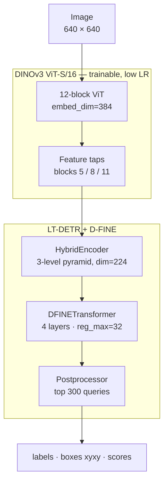

# Detection Models

Both CNN and transformer-based CV models were applied to achieve high-precision detection of floating debris on the sea surface.

## Overview — Performance Comparison

Single-class (`litter`) detection on the custom `Litter` dataset (1,050 / 300 / 151 train / val / test). Numbers below are the **best reported mAP** for each method family; see each section for protocol details (Ultralytics val vs torchmetrics test).

| Method | Representative model | mAP@50 | mAP@50-95 | Package | Protocol |
| :--- | :--- | ---: | ---: | ---: | :--- |
| **Baseline** | YOLO11n `best3.pt` (2 epochs) | 0.950 | 0.682 | 5.2 MB | Val (Ultralytics) |
| **Simple fine-tuning (nano)** | YOLO11n (100 epochs) | 0.9787 | 0.7807 | ~5 MB | Val (Ultralytics) |
| **Simple fine-tuning (medium)** | YOLO11m (100 epochs, stock) | <font color="blue">**0.9872**</font> | 0.7920 | ~40 MB | Val (Ultralytics) |
| **Distillation** | DINOv3-Large → YOLO11m | 0.9869 | 0.7913 | ~41 MB | Val best after distill + FT |
| **D-FINE** | DINOv3 ViT-S/16 + D-FINE | 0.9843 | <font color="blue">**0.8268**</font> | ~141 MB | Test (torchmetrics) |

| Takeaway | Detail |
| :--- | :--- |
| **Best YOLO mAP@50** | Stock **YOLO11m** fine-tune (0.9872) — tied with best distilled medium within noise |
| **Best mAP@50-95 / localization** | **D-FINE** (0.827 test) — largest gain on box quality & small objects |
| **Distillation lift** | **No meaningful gain** vs capacity-matched stock FT (11n or 11m); prior “medium wins” were mostly **n→m capacity**, not distill |
| **Best small edge model** | Stock fine-tuned **YOLO11n** (~5 MB); distilled nano is **worse** than stock 11n |

> Full distillation matrix (10 teacher–student pairs), D-FINE Jetson notes, and training configs are in the sections below.

---

## Baseline / Previous Work

A fine-tuned **YOLO11n** model (`best3.pt`) trained on a custom dataset (`Litter`) serves as the baseline for all later fine-tuning, distillation, and training.

### Custom Dataset — `Litter`

| Item | Value |
| :--- | :--- |
| **Config** | `Litter.yaml` |
| **Resolution** | `1920 × 1080` |
| **Format** | JPEG |

#### Split Overview

| Split | Images | Labels | Boxes |
| :---: | -----: | -----: | ----: |
| train | 1,050 | 1,050 | 5,736 |
| val   |   300 |   300 | 1,661 |
| test  |   152 |   151 |   784 |

---

### Baseline Model — `best3.pt`

#### Basic Info

| Attribute | Value |
| :--- | :--- |
| Model Name | `best3.pt` |
| Base Model | **yolo11n** |
| Task | Object Detection |
| Detection Class | `0: litter` |
| Parameters | 2,590,035 |
| GFLOPS | 6.4 |
| DTYPE | float16 |
| Size | 5.2 MB |

#### Fine-tuning Config

| Attribute | Value |
| :--- | :--- |
| Dataset | Litter |
| Data Config | `data2.yaml` |
| Epochs | 2 |
| Image Size | 640 |
| Batch Size | 8 |
| Optimizer | None |
| LR schedule | `lr0=0.01`, `lrf=0.01` |
| AMP Enabled | `False` |

#### Model Performance

| Metric | Value |
| :--- | ---: |
| Precision | 0.948 |
| Recall | 0.883 |
| mAP@50 | 0.950 |
| mAP@50-95 | 0.682 |
| Val box / cls / dfl loss | 7.5 / 0.5 / 1.5 |

<table>
  <tr>
    <td align="center" width="50%">
      <br>
      <em>Confusion Matrix</em>
    </td>
    <td align="center" width="50%">
      <br>
      <em>Training Results</em>
    </td>
  </tr>
</table>

---

## Fine-tuning

The baseline (`best3.pt`) was originally fine-tuned for only **2 epochs** — far below a typical YOLO schedule. To check whether the epoch limit was holding performance back, a new YOLO11n fine-tuning run was conducted.

### Fine-tuning Platform
- Dell Precison 5490
    - CPU: Intel Ultra7 165H
    - GPU: NVIDIA RTX 2000 Ada Mobile

### Fine-tuning Configuration

| Attribute | Value |
| :--- | :--- |
| Base Model | `yolo11n.yaml` |
| Dataset | `Litter` |
| Detection Class | `0: litter` |
| Image Size | 640 |
| Batch Size | <font color="blue">16</font> |
| Optimizer | <font color="blue">AdamW</font> |
| Epochs | <font color="red">100</font> |
| LR schedule | `lr0=0.01`, `lrf=0.01` |
| AMP Enabled | `True` |

### Model Performance

| Metric | Value |
| :--- | ---: |
| Precision | 0.9752 |
| Recall | 0.9555 |
| mAP@50 | 0.9787 |
| mAP@50-95 | 0.7807 |
| Val box / cls / dfl loss | 0.747 / 0.375 / 0.833 |

<table>
  <tr>
    <td align="center" width="50%">
      <br>
      <em>Confusion Matrix</em>
    </td>
    <td align="center" width="50%">
      <br>
      <em>Training Results</em>
    </td>
  </tr>
</table>

### Performance Comparison

| Metric | 2 epochs | 100 epochs |
| :--- | ---: | ---: |
| Precision | 0.948 | <font color="blue">0.9752 (+2.9%)</font> |
| Recall | 0.883 | <font color="blue">0.9555 (+8.2%)</font> |
| mAP@50 | 0.950 | <font color="blue">0.9787 (+3.0%)</font> |
| mAP@50-95 | 0.682 | <font color="blue">0.7807 (+14.5%)</font> |
| Val box / cls / dfl loss | 7.5 / 0.5 / 1.5 | <font color="blue">0.747 / 0.375 / 0.833</font> |

>With `epochs` set to 2, fine-tuning was clearly under-powered. Given that only a CPU was used for the original run, it is likely the trainer chose a small epoch count to cut wall-clock time — at the cost of model performance.

### Stock YOLO11m fine-tune (no distill)

A capacity-matched medium baseline was also trained from official `yolo11m.pt` (same `Litter` data, 100 epochs, AdamW, imgsz 640, batch auto).

| Metric | YOLO11n stock | YOLO11m stock |
| :--- | ---: | ---: |
| Best mAP@50 | 0.9787 | <font color="blue">**0.9872**</font> |
| Best mAP@50-95 | 0.7807 | <font color="blue">**0.7920**</font> |
| Final mAP@50 / mAP@50-95 | 0.9791 / 0.7790 | 0.9811 / 0.7914 |
| Package | ~5 MB | ~40 MB |

Medium capacity alone adds ~**+0.9 pp** mAP@50 and ~**+1.1 pp** mAP@50-95 over stock nano — the same magnitude later mis-attributed to distillation when distilled 11m was only compared to stock 11n. See [Distillation Results](#distillation-results).

---

## Distillation

This part introduces a <u>**feature distillation from frozen pretrained foundation models**</u>. 

To actualize the best distillation performance, multiple teacher-student combinations were tested as follows:

> **Teacher models:** frozen DINOv3 feature backbones. **Student models:** YOLO detectors — Nano ≈ 2.6 M params, Medium ≈ 20 M params.

| Combination | Teacher Model | Teacher Size | Student Model | Student Size |
| :---: | :--- | :---: | :--- | :---: |
| 1 | `vits16plus` | <font color="blue">Small</font> | `yolo11n` | <font color="gray">Nano</font> |
| 2 | `vitl16` | <font color="purple">Large</font> | `yolo11n` | <font color="gray">Nano</font> |
| 3 | `vith16plus` | <font color="red">Huge</font> | `yolo11n` | <font color="gray">Nano</font> |
| 4 | `vits16plus` | <font color="blue">Small</font> | `yolo26n` | <font color="gray">Nano</font> |
| 5 | `vitl16` | <font color="purple">Large</font> | `yolo26n` | <font color="gray">Nano</font> |
| 6 | `vith16plus` | <font color="red">Huge</font> | `yolo26n` | <font color="gray">Nano</font> |
| 7 | `vits16plus` | <font color="blue">Small</font> | `yolo11m` | <font color="orange">Medium</font> |
| 8 | `vitl16` | <font color="purple">Large</font> | `yolo11m` | <font color="orange">Medium</font> |
| 9 | `vith16plus` | <font color="red">Huge</font> | `yolo11m` | <font color="orange">Medium</font> |
| 10 | `vitl16` | <font color="purple">Large</font> | `yolo26m` | <font color="orange">Medium</font> |


| Teacher \ Student | `yolo11n` | `yolo26n` | `yolo11m` | `yolo26m` |
| :--- | :---: | :---: | :---: | :---: |
| `vits16plus` | 1 | 4 | 7 | — |
| `vitl16` | 2 | 5 | 8 | 10 |
| `vith16plus` | 3 | 6 | 9 | — |


### Distillation Overview

| Item | Value |
| :--- | :--- |
| Foundation Model | `DINOv3` — `vits16plus` / `vitl16` / `vith16plus` (see table above) |
| Student Model | `YOLO11` / `YOLO26` — `yolo11n` / `yolo26n` / `yolo11m` / `yolo26m` (see table above) |
| Training Framework | `LightlyTrain` |
| Training Method | `distillationv3` |
| Sample Training Script | [distill.py](/Detection/Distillation/distill.py) |
| Epochs | 100 |
| Steps | 800 |
| Batch Size | 128 |
| Optimizer | AdamW |
| DTYPE | BF16-mixed |
| Dataset | `Litter` |

- Training Pipeline


- Training Step


### Distillation Results

Downstream detection: each distilled student was fine-tuned **100 epochs** on labeled `Litter` (imgsz 640). Metrics are **best** val mAP during that fine-tune unless noted.

> Full write-up: [distillation experiment analysis](/Detection/Distillation/distillation_experiment_analysis.md).

#### Capacity-matched stock controls (no distill)

| Run | Model | Best mAP@50 | Best mAP@50-95 | Final mAP@50 | Final mAP@50-95 | Notes |
| :--- | :--- | ---: | ---: | ---: | ---: | :--- |
| `yolo11n_stock` | **YOLO11n** (from `yolo11n.pt`) | 0.9787 | **0.7807** | 0.9791 | 0.7790 | batch 16, 100 ep |
| `yolo11m_stock` | **YOLO11m** (from `yolo11m.pt`) | <font color="blue">**0.9872**</font> | **0.7920** | 0.9811 | 0.7914 | batch auto (`-1`), 100 ep |

These are the correct controls for “did distillation help?” — compare distilled **11n** to stock **11n**, distilled **11m** to stock **11m**.

#### Full cross comparison (all 10 distill runs)

| Rank (mAP@50-95) | Teacher | Student | Best mAP@50 | Best mAP@50-95 | vs stock same size |
| ---: | :--- | :--- | ---: | ---: | ---: |
| — | *(control)* | **YOLO11m stock FT** | **0.9872** | **0.7920** | — |
| 1 | Huge (`vith16plus`) | YOLO11m | 0.9808 | 0.7931 | ≈0 / **−0.6 pp** mAP@50 |
| 2 | Small (`vits16plus`) | YOLO11m | 0.9846 | 0.7923 | ≈0 / −0.3 pp mAP@50 |
| 3 | Large (`vitl16`) | YOLO11m | 0.9869 | 0.7913 | ≈0 / −0.0 pp mAP@50 |
| 4 | Large (`vitl16`) | YOLO26m | 0.9836 | 0.7815 | *(no stock 26m)* |
| — | *(control)* | **YOLO11n stock FT** | **0.9787** | **0.7807** | — |
| 5 | Huge | YOLO11n | 0.9743 | 0.7624 | <font color="red">−1.8 pp</font> mAP@50-95 |
| 6 | Small | YOLO11n | 0.9734 | 0.7575 | <font color="red">−2.3 pp</font> |
| 7 | Large | YOLO11n | 0.9721 | 0.7564 | <font color="red">−2.4 pp</font> |
| 8 | Huge | YOLO26n | 0.9648 | 0.7355 | <font color="red">−4.5 pp</font> vs stock 11n |
| 9 | Large | YOLO26n | 0.9640 | 0.7336 | <font color="red">−4.7 pp</font> |
| 10 | Small | YOLO26n | 0.9651 | 0.7284 | <font color="red">−5.2 pp</font> |

#### Distillation vs stock fine-tune (capacity-matched)

| Comparison | Best mAP@50 | Best mAP@50-95 | Verdict |
| :--- | ---: | ---: | :--- |
| Stock **YOLO11m** | **0.9872** | 0.7920 | **Best YOLO medium** |
| Distilled YOLO11m (best) | 0.9869 (Large) | 0.7931 (Huge) | **No meaningful lift** (≤0.1 pp, within noise) |
| Stock **YOLO11n** | **0.9787** | **0.7807** | **Best nano** |
| Distilled YOLO11n (best) | 0.9743 (Huge) | 0.7624 (Huge) | <font color="red">**Worse**</font> (−1.8 pp mAP@50-95) |

> Earlier comparisons of distilled **YOLO11m** to stock **YOLO11n** looked like a distill win (+1 pp mAP@50-95). That gap is almost entirely **student capacity (n→m)**. Against stock **YOLO11m**, distillation adds nothing on this dataset.

#### By student capacity (Small teacher fixed)

| Student | Best mAP@50 | Best mAP@50-95 |
| :--- | ---: | ---: |
| YOLO26n | 0.9651 | 0.7284 |
| YOLO11n | 0.9734 | 0.7575 |
| **YOLO11m** | **0.9846** | **0.7923** |

Medium **YOLO11m** still ranks above nano under the same teacher — but that is capacity, not a distill effect (see stock 11m above).

#### By teacher size (YOLO11m fixed, T=0.07)

| Teacher | Best mAP@50 | Best mAP@50-95 | Distill `local_loss` (last 10 ep) | vs stock 11m mAP@50-95 |
| :--- | ---: | ---: | ---: | ---: |
| **Large** | **0.9869** | 0.7913 | 0.659 | −0.07 pp |
| Small | 0.9846 | 0.7923 | **0.129** | +0.03 pp |
| Huge | 0.9808 | **0.7931** | 1.026 | +0.11 pp |
| *(stock 11m)* | **0.9872** | **0.7920** | — | — |

All three teachers land in a **±0.1 pp** band around stock YOLO11m on mAP@50-95. Distill loss ranks Small ≪ Large < Huge and **does not** predict detection mAP.

#### Architecture control (Large teacher fixed): YOLO11m vs YOLO26m

| Student | Best mAP@50 | Best mAP@50-95 | Distill local (last 10) |
| :--- | ---: | ---: | ---: |
| **YOLO11m** | **0.9869** | **0.7913** | 0.659 |
| YOLO26m | 0.9836 | 0.7815 | 0.647 |

Feature-match quality is nearly identical; detection still favors **YOLO11m** by ~**1.0 pp** mAP@50-95. Same pattern on nano: **YOLO11n ≫ YOLO26n**. Neither family needs distillation to explain the ranking once stock 11m is in the picture.

#### TLDR — revised conclusion

| Finding | Detail |
| :--- | :--- |
| **Main result** | **Distillation does not improve** capacity-matched detection on this ~1,050-image set |
| **Student Model Capacity** | Tiny model does not beneifts on par as larger model through distillation |
| **Student Model Architecture** | The architecture of the YOLO11 family suits better for knowledge transfer |
| **Bottleneck** | Small unlabeled distill set; labeled supervised FT already saturates YOLO heads |

---

## D-FINE

Neither distillation nor scaling YOLO11 n→m closes the localization gap for small floating debris: stock **YOLO11m** tops YOLO mAP@50 (~0.987) but mAP@50-95 stays ~0.79. As an accuracy-first alternative, a full **DINOv3 ViT-S/16 backbone + D-FINE (LT-DETR) detection head** was trained end-to-end with [LightlyTrain](https://docs.lightly.ai/train/) — foundation features plus a transformer decoder built for fine box regression.

> **Registry model:** `dinov3/vits16-ltdetr` · **Decoder:** `dfine` · **Class:** `0: litter`

### Motivation

| Context | Detail |
| :--- | :--- |
| Domain | UAV / maritime floating debris; many boxes are COCO-**small** at 640 input (median width ~23 px) |
| Distillation outcome | **No lift** vs stock FT at matched capacity; nano distill **hurts** (see above) |
| YOLO ceiling | Stock YOLO11m ~0.792 mAP@50-95 — still well below D-FINE on box quality |
| This run | Full fine-tune of **DINOv3 ViT-S/16 + D-FINE** on the same labeled `Litter` split |
| Goal | Higher mAP@50-95 and small-object mAP vs YOLO baselines |

Native frames are **1920 × 1080**; training / inference use **640 × 640**. D-FINE's fine-grained localization (`reg_max=32`, `reg_scale=4.0`) targets tight boxes on small litter.

### Architecture

| Component | Config |
| :--- | :--- |
| Backbone | **DINOv3 ViT-S/16** (`embed_dim=384`, depth 12, 6 heads, patch 16, MLP FFN) |
| Pretrain | LVD-1689M — `dinov3_vits16_pretrain_lvd1689m-08c60483.pth` (~86 MB) |
| Detection head | **D-FINE** (`DFINETransformer`), 4 layers, hidden dim 224 |
| Encoder | HybridEncoder, 3-level pyramid, `hidden_dim=224`, 1 encoder layer |
| ViT taps | Interaction indexes `[5, 8, 11]` |
| Queries | top **300** |
| Matcher | Hungarian + focal (`cost_class=2`, `cost_bbox=5`, `cost_giou=2`) |

> There is **no** `dinov3/vits16plus-ltdetr` in LightlyTrain 0.16.2, so training uses **ViT-S/16** (MLP FFN), not ViT-S/16+ (SwiGLU). YOLO-style heads expect CNN pyramids; **LT-DETR / D-FINE** is the supported ViT detection path.



### Training Platform

- **DGX Spark** (`192.168.1.18`, NVIDIA **GB10**, aarch64)
    - Framework: `lightly_train` **0.16.2** + PyTorch 2.13 / CUDA 13
    - Wall time: **~5.3 h** (6600 steps, ~2.86 s/step, ~11 img/s)
    - Peak train GPU mem: ~22 GB

### Training Configuration

| Attribute | Value |
| :--- | :--- |
| Model | `dinov3/vits16-ltdetr` |
| Decoder | <font color="blue">`dfine`</font> |
| Dataset | `Litter` (YOLO format, `0: litter`) |
| Image Size | 640 |
| Steps | <font color="red">6600</font> (≈ 100 epochs × 1050 / 16) |
| Batch Size | 16 (grad accum 2 → effective **32**) |
| Optimizer | AdamW |
| Decoder LR | `5e-4` |
| Backbone LR | `2.5e-5` (`backbone_lr_factor=0.05`) |
| Weight Decay | `1e-4` |
| Scheduler | flat-cosine |
| Precision | `bf16-mixed` |
| EMA | on (`0.9999`, warmup 2000 steps) |
| Grad clip | `0.1` |
| Backbone freeze | `False` (full fine-tune) |
| Watch metric | `val_metric/map` (mAP@50-95) → **best** checkpoint |
| Seed | 0 |

**Data dict** (LightlyTrain 0.16.2 requires `"format": "yolo"` — a plain `data.yaml` path alone fails the config discriminator):

```python
DATA = {
    "format": "yolo",
    "path": "/path/to/Litter",  # train / val / test YOLO layout
    "train": "train/images",
    "val": "val/images",
    "test": "test/images",
    "names": {0: "litter"},
}

lightly_train.train_object_detection(
    out="out/det_vits16_dfine",
    data=DATA,
    model="dinov3/vits16-ltdetr",
    steps=6600,
    batch_size=16,
    model_args={
        "decoder_name": "dfine",
        "backbone_weights": "dinov3_vits16_pretrain_lvd1689m-08c60483.pth",
    },
)
```

### Validation Progress

| Step | val mAP@50-95 |
| ---: | ---: |
| 999 | 0.702 |
| 1999 | 0.786 |
| 2999 | 0.800 |
| 3999 | 0.813 |
| **4999** | **0.825 (best)** |
| 5999 | 0.820 |
| 6599 (last) | 0.813 |

Prefer **`exported_best.pt`** (step 4999) over `exported_last.pt`.

#### Best Val Metrics (step 4999)

| Metric | Value |
| :--- | ---: |
| mAP@50-95 | **0.8249** |
| mAP@50 | **0.9853** |
| mAP@75 | 0.9585 |
| mAP small | 0.6045 |
| mAP medium | 0.8157 |
| mAP large | 0.8810 |

### Test-set Performance

Protocol: `torchmetrics.detection.MeanAveragePrecision` (xyxy), score keep ≥ 0.001, **151** held-out test images / **784** GT boxes — same protocol for both models.

| Metric | DINOv3 + D-FINE | Distilled YOLO11n | Δ (D-FINE − YOLO) |
| :--- | ---: | ---: | ---: |
| **mAP@50-95** | **0.8268** | 0.7738 | <font color="blue">+0.053</font> |
| **mAP@50** | **0.9843** | 0.9762 | <font color="blue">+0.008</font> |
| mAP@75 | **0.9558** | 0.9264 | <font color="blue">+0.029</font> |
| **mAP small** | **0.6351** | 0.4512 | <font color="blue">+0.184</font> |
| mAP medium | **0.8202** | 0.7727 | <font color="blue">+0.048</font> |
| mAP large | **0.8879** | 0.8237 | <font color="blue">+0.064</font> |
| mar@100 | **0.8754** | 0.8194 | <font color="blue">+0.056</font> |

### Cross-method Comparison

| Method | mAP@50 | mAP@50-95 | Notes |
| :--- | ---: | ---: | :--- |
| YOLO11n baseline (`best3.pt`, 2 ep) | 0.950 | 0.682 | Under-trained |
| YOLO11n fine-tune (100 ep, stock) | 0.9787 | 0.7807 | Val (Ultralytics) |
| YOLO11m fine-tune (100 ep, stock) | **0.9872** | 0.7920 | Val — best YOLO mAP@50 |
| Distilled YOLO11n (best: ViTh → 11n) | 0.9743 | 0.7624 | Val — worse than stock 11n |
| Distilled YOLO11m (best mAP@50: ViTl → 11m) | 0.9869 | 0.7913 | Val — ≈ stock 11m (no lift) |
| Distilled YOLO11n (ViTs → 11n, fair test) | 0.9762 | 0.7738 | Test (torchmetrics) vs D-FINE |
| **DINOv3 + D-FINE** | **0.9843** | **0.8268** | Test (torchmetrics) |

On the held-out **test** set (same torchmetrics protocol), D-FINE beats distilled YOLO11n on every COCO mAP metric — largest gains on **small objects** (+18.4 pp mAP small) and **box quality** (mAP@50-95). Among YOLO variants, **stock YOLO11m** owns peak mAP@50; distillation does not beat it.

<table>
  <tr>
    <td align="center" width="50%">
      <br>
      <em>D-FINE inference — sample A (litter confidences ~0.87–0.93)</em>
    </td>
    <td align="center" width="50%">
      <br>
      <em>D-FINE inference — sample B (`exp29_pic215`)</em>
    </td>
  </tr>
</table>

### Artifacts & Size Tradeoff

| Artifact | Size | Use |
| :--- | ---: | :--- |
| `exported_best.pt` | ~141 MB | Deploy / ONNX export |
| `best.ckpt` | ~563 MB | Lightning resume |
| `model_fp32.onnx` | ~141 MB | TRT / ORT source |
| `model_fp16.onnx` | ~124 MB | Edge experiments |

| Model | Package size | Role |
| :--- | ---: | :--- |
| YOLO11n (fine-tuned) | ~5 MB | Edge-speed default |
| DINOv3 + D-FINE | ~141 MB | Accuracy-first / Jetson-class |

### Edge Deployment (Jetson Xavier AGX)

Export path: Spark (ONNX) → TRT-8.5-compat rewrite → **build engine on Jetson** (SM-arch specific).

| Engine | GPU latency (median) | Real detections |
| :--- | ---: | :--- |
| FP32 TRT | ~177 ms | Yes (recommended) |
| pure FP16 TRT | ~80 ms | **No** (NaN scores/boxes on this ViT+DETR graph) |

- Input: `1 × 3 × 640 × 640`, ImageNet normalize  
- Output: `labels (1,300)`, `boxes (1,300,4)` xyxy in 640-space, `scores (1,300)`  
- Preprocess must match training (resize stretch, RGB, `/255`, mean/std)

### TLDR

| Finding | Detail |
| :--- | :--- |
| **Wins on accuracy** | Best test mAP@50-95 (**0.827**) and mAP@50 (**0.984**) among methods tried |
| **Small objects** | Largest relative gain vs distilled YOLO11n (+18.4 pp mAP small) |
| **Cost** | ~28× larger package than YOLO11n; Xavier FP32 ~177 ms (misses ≤100 ms budget unless mixed-precision is fixed) |
| **When to use** | Accuracy-first UAV / Jetson Orin-class deployments; keep YOLO11n when size/latency dominate |
| **Not done** | RT-DETR v2 bake-off, higher imgsz (800/1024), SAHI-centric schedule |


