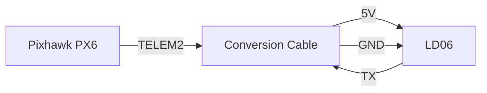
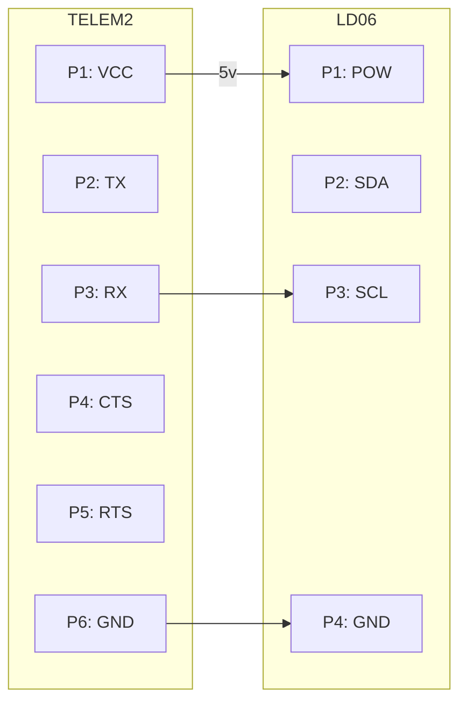

# LD06
LDRobot LD06 has been selected as the obstacle detection sensor for the drone project.

## Consideration
- Availability: As the project member already obtains one LD06, it has been used for preliminary test.
- Compatibility: Official support from the ardupilot.
- Cost: Relative low cost at 500HKD with no additional SBC required.

## Specification
- Detection Range: 12 meters radium (100% reflection)
- Sampling rate: 4500 Hz (4500 detection dots per second)
- Rotation Speed: up to 10 Hz
- Light resistence: 30,000 Lux
- Weight: 45 gram
- Communication Standards: UART
- Baud Rate: 230400

## Wiring
- Overall

> As PX6's TELEM1 port has been occupied by the mavlink transmitter. TELEM2 was selected for LD06. Due to pinout differences[^1], a custom conversion cable was soldered.

- Pin-level wiring

## Ardupilot Config
To enable simple object avoidance[^2], some parameters have to be changed in either Mission Planner or QGroundControl[^3].
- Rangefider Config

| Paramter | Value | Remarks |
| -------- | ----- | ------- |
| SERIAL2_PROTOCOL | 11 (Lidar360) | N.A. |
| SERIAL2_BAUD | 230400 | Need Mannual Input |
| PRX1_TYPE | 16 | N.A. |
| PRX1_ORIENT | 0 | When placed on top of the UAV |
| BRD_SER2_RTSCTS | 0 | Default Value |

> You can examine the LiDAR detection output in Mission Planner's Proximity Chart
- Simple Object Avoidance Config

---
### References
[^1]: [Pixhawk PX6 Pinout](https://docs.holybro.com/autopilot/pixhawk-6c/pixhawk-6c-ports)
[^2]: [Ardupilot Simple Object Avoidance](https://ardupilot.org/copter/docs/common-simple-object-avoidance.html)
[^3]: [Ardupilot Rangefinders](https://ardupilot.org/copter/docs/common-ld06.html)
