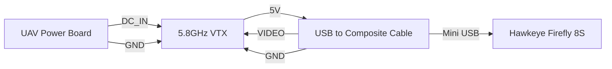
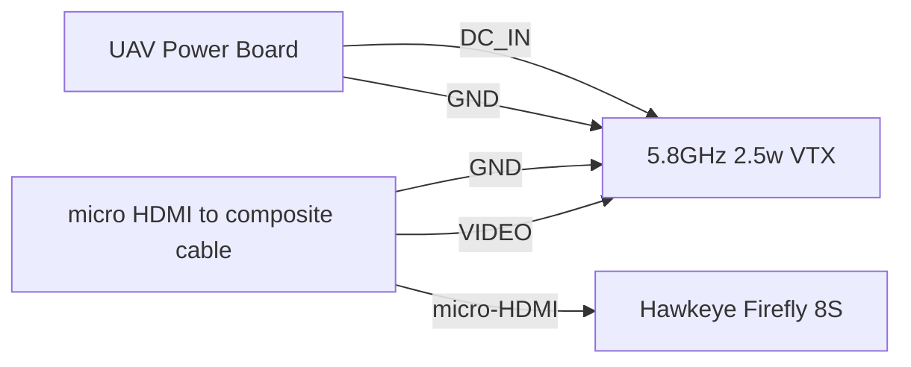

# Camera
The entire video transmission pipeline

## Components
| Item | Name | Function | Remarks |
| ---- | ---- | -------- | ------- |
| 1 | Hawkeye Firefly 8S | Video source | Broken USB function |
| 2 |~~USB to Composite Cable~~ | Digital/Analog Conversion, Signaling, Charging | Not in Use |
| 3 | HDMI Composite Cable| HDMI/Analog Conversion | No charging functions |
| 4 | GEPRC 5.8G 2.5W TX | VTX | No antenna included|
| 5 | Ground VRX | Converts composite 5.8G video signal to UVC signal for digital processing | for debris detection |
| 6 | Control Display | Direct display of the composite video stream | for pilot |

## Wiring
- Original Wiring __(Obsolete)__

> Upon testing, a malfunctioned usb has been found on the camera. Hence, a new video pipeline is proposed.
---
> __CAUTION!!!__ As HDMI does not support power_in and signal_in, the current solution does not support charging the camera nor control the camera.
- New wiring

## Ground RX
Please refers to [OMM](https://github.com/AnaOnTram/OMM.git) for debris detection solution.